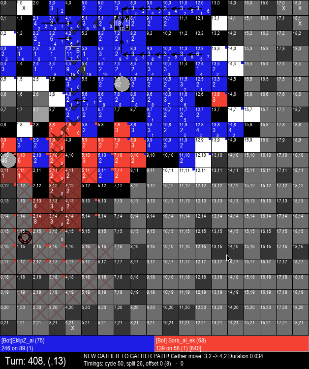

# Generals.io - Automated Client

## Synopsis

[Generals.io](http://generals.io) is a multiplayer web game where the goal is to protect your general and capture the enemy generals.  

## Setup

- [ ] Python3 (https://www.python.org/downloads/)
- [ ] Install Dependencies: `pip3 install -r requirements.txt`

## Usage
(might need to tweak some hardcoded paths.... This was only ever intended for my use and opensourced later)

Powershell:

. "C:\generals-bot\run-bot.ps1"
run-bot -game 1v1, 1v1, 1v1, ffa, ffa -name "EklipZ_ai" -right #-noui

Ask me questions in discord! @EklipZ#3166 https://discord.gg/tchBMdN

DO NOT run this on the human servers when it is not working. The reason bots were banned on the human server was due to poor/crashing/afk/random-move bots taking up games on the human server which led to boring games and wasted peoples time. Do not contribute to that problem. Get everything working on the bot server, and get your bot up to par where it is at least challenging to play against for some humans before even considering running it on the Human server. Thank you!

## Contributors

@harrischristiansen [HarrisChristiansen.com](http://www.harrischristiansen.com) (harris@harrischristiansen.com)  Original source

@EklipZgit (me) forked and wrote the bot portion from scratch for EklipZ_ai AKA Human.exe
